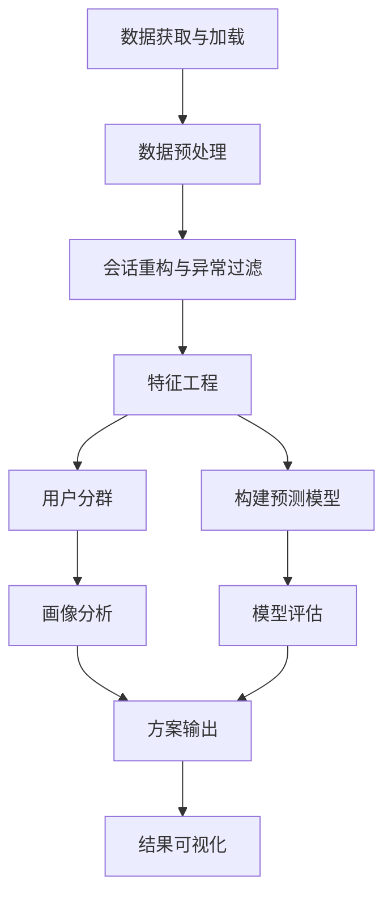

# 电商用户行为画像与购买倾向系统设计与实现
## 毕业设计实施规划方案

### 一、研究背景与意义

#### 1. 研究背景
随着电子商务的快速发展，用户行为数据呈现爆炸式增长。如何有效利用这些数据了解用户需求、预测用户行为，成为电商平台提升运营效率和用户体验的关键。用户行为画像是一种通过分析用户历史行为数据，构建用户特征模型的方法，能够帮助企业更精准地理解用户，实现个性化推荐和精准营销。

本研究基于真实的电商用户行为数据，通过数据挖掘和机器学习技术，构建用户行为画像并预测用户购买倾向，为电商平台的运营决策提供数据支持。

#### 2. 研究意义
- **理论意义**：探索电商用户行为数据的分析方法，丰富用户画像和购买预测的理论体系。
- **实践意义**：
  - 帮助电商平台识别高价值用户，制定针对性的营销策略。
  - 提高用户转化率，提升平台整体销售业绩。
  - 优化用户体验，增强用户粘性。
  - 为新客激活和老客召回提供数据支撑。

### 二、具体研究目标

1. **数据预处理**：完成会话重构、去重与异常点击过滤，确保数据质量。
2. **特征工程**：提取RFM（最近购买时间、购买频率、购买金额）、最近浏览品类数、加购/收藏比、转化漏斗位置等关键特征。
3. **用户分群**：使用K-Means聚类算法对用户进行分群，构建用户画像。
4. **购买倾向预测**：以"本周是否下单/是否复购"为标签，训练逻辑回归、决策树、随机森林等分类模型。
5. **模型评估**：使用准确率、召回率、AUC等指标评估模型性能，输出混淆矩阵与特征重要性。
6. **方案输出**：形成"画像分群+倾向预测"的轻量方案与建议规则，用于新客激活与老客召回。

### 三、详细的技术路线图

#### 1. 数据获取与加载
- 加载用户数据（data/JD_IJCAI 19/user）
- 加载商品数据（data/JD_IJCAI 19/item_info）
- 加载用户点击数据（data/JD_IJCAI 19/user_click）
- 加载用户订单数据（data/JD_IJCAI 19/user_order）
- 数据初步探索与基本统计分析

#### 2. 数据预处理
- 数据清洗：处理商品数据中的缺失值（price、seg_name、brand_code）和异常值
- 数据集成：将用户点击数据和订单数据与用户数据和商品数据进行关联
- 数据转换：时间格式转换、用户行为数据整合

#### 3. 会话重构与异常过滤
- 会话定义：基于时间间隔（如30分钟）划分用户会话
- 会话去重：去除重复的用户行为记录
- 异常点击过滤：识别并过滤异常的点击行为（如短时间内大量点击）

#### 4. 特征工程
- RFM特征：计算最近购买时间（Recency）、购买频率（Frequency）、购买金额（Monetary）
- 浏览行为特征：最近浏览品类数、浏览深度
- 交互行为特征：加购/收藏比、评论数
- 转化漏斗特征：各阶段转化率、停留时间

#### 5. 用户分群
- 使用K-Means聚类算法对用户进行分群
- 确定最优聚类数量（如通过肘部法则）
- 分析各用户群体的特征和行为模式

#### 6. 构建预测模型
- 标签定义："本周是否下单"、"是否复购"
- 数据集划分：训练集、验证集、测试集
- 模型训练：逻辑回归、决策树、随机森林
- 模型调优：网格搜索、交叉验证

#### 7. 模型评估
- 评估指标：准确率、召回率、F1值、AUC
- 混淆矩阵分析
- 特征重要性分析
- 模型对比与选择

#### 8. 方案输出
- 生成用户画像报告
- 制定新客激活策略
- 制定老客召回策略
- 输出操作规则与建议

#### 9. 结果可视化
- 用户分群可视化
- 特征重要性可视化
- 模型性能可视化
- 策略效果模拟

### 四、合理的时间进度安排

| 阶段 | 时间 | 任务 |
|------|------|------|
| 准备阶段 | 第1-2周 | 数据获取、环境搭建、文献综述 |
| 数据预处理阶段 | 第3-4周 | 数据清洗、集成、转换、会话重构 |
| 特征工程阶段 | 第5-6周 | 提取RFM等特征，构建特征工程 |
| 模型构建阶段 | 第7-9周 | 用户分群、购买倾向预测模型训练 |
| 模型评估阶段 | 第10周 | 模型评估、调优与选择 |
| 方案输出阶段 | 第11-12周 | 生成用户画像报告，制定营销策略 |
| 论文撰写阶段 | 第13-15周 | 撰写毕业设计论文 |
| 答辩准备阶段 | 第16周 | 准备答辩材料，进行答辩演练 |

### 五、预期成果与交付物清单

#### 1. 预期成果
- 构建完整的电商用户行为画像系统
- 实现准确的购买倾向预测模型
- 形成可操作的新客激活与老客召回策略
- 提高电商平台的用户转化率和销售业绩

#### 2. 交付物清单
- **代码文件**：
  - 数据预处理脚本
  - 特征工程脚本
  - 模型训练与评估脚本
  - 结果可视化脚本
- **分析报告**：
  - 数据探索分析报告
  - 用户画像分析报告
  - 模型性能评估报告
- **毕业设计论文**：
  - 完整的学术论文，包含研究背景、方法、实验结果与分析
- **演示文档**：
  - 系统功能演示PPT
  - 操作说明文档

### 六、关键技术难点及解决方案

#### 1. 关键技术难点
- **数据预处理**：如何处理商品数据中的缺失值（特别是price字段）
- **数据规模**：如何高效处理5298万条点击数据，避免内存不足
- **特征工程**：如何提取最能反映用户购买倾向的特征
- **数据不平衡**：购买行为数据与点击行为数据比例约为1:36，如何处理严重的类不平衡问题

#### 2. 解决方案
- **数据预处理**：对price字段使用中位数填充，对seg_name字段使用item_name的分词结果填充
- **数据规模**：采用数据分块处理（chunksize参数），优化内存使用，确保数据处理效率
- **特征工程**：结合业务知识和机器学习方法，选择和构造最具预测力的特征，如RFM、浏览品类数、商品偏好等
- **数据不平衡**：采用SMOTE过采样或欠采样技术，调整类别权重，使用F1值、AUC等更适合不平衡数据的评估指标

### 七、必要的资源需求分析

#### 1. 硬件资源
- 计算机：具备足够的内存（至少16GB）和存储空间（至少100GB）
- 计算能力：能够运行Python及其数据科学库，处理千万级数据

#### 2. 软件资源
- 操作系统：Windows 10或以上
- 开发环境：Python 3.12或以上
- 核心库：
  - pandas 3.0+：数据处理
  - NumPy 2.4+：数值计算
  - scikit-learn 1.4+：机器学习
  - Matplotlib 3.8+：数据可视化
  - Jupyter Notebook 7.0+：交互式开发

#### 3. 数据资源
- 用户数据：data/JD_IJCAI 19/user
- 商品数据：data/JD_IJCAI 19/item_info
- 用户点击数据：data/JD_IJCAI 19/user_click
- 用户订单数据：data/JD_IJCAI 19/user_order

#### 4. 其他资源
- 文献资料：相关的学术论文、技术博客
- 开发文档：Python库的官方文档
- 计算资源：如需处理更大规模数据，可能需要使用云服务或高性能计算资源

### 八、总结

本毕业设计项目通过分析电商用户行为数据，构建用户画像并预测购买倾向，为电商平台的运营决策提供数据支持。项目采用数据挖掘和机器学习技术，实现了从数据预处理到模型部署的完整流程。通过本项目的实施，不仅能够提升电商平台的运营效率和用户体验，也能够为相关领域的研究提供参考。

预期本项目将取得以下成果：
1. 建立准确的用户行为画像系统
2. 开发高性能的购买倾向预测模型
3. 制定有效的新客激活与老客召回策略
4. 完成符合学术规范的毕业设计论文

通过本项目的实施，将为电商行业的精准营销和个性化推荐提供新的思路和方法。